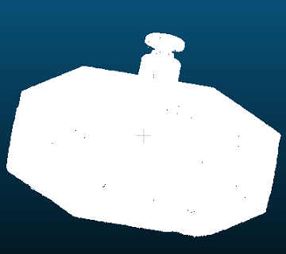

# color_using_normal
通过计算每个点的`normal_x/y/z`在`max_normal_x/y/z-min_normal_x/y/z`上的占比，来显示颜色变化
``` C++
total_nx = max_nx - min_nx,
total_ny = max_ny - min_ny,
total_nz = max_nz - min_nz;

point[i].r = 255 * (cloud_normal->points[i].normal_x - min_nx) / total_nx;
point[i].g = 255 * (cloud_normal->points[i].normal_y - min_ny) / total_ny;
point[i].b = 255 * (cloud_normal->points[i].normal_z - min_nz) / total_nz;
```

# 效果



# 使用
``` C++
pcl::PCLPointCloud2::Ptr cloud(new pcl::PCLPointCloud2);
pcl::PointCloud<pcl::PointXYZRGB>::Ptr cloud_rgb(new pcl::PointCloud<pcl::PointXYZRGB>());

CloudTools cloud_tools;
cloud_tools.color_using_normal(cloud, cloud_rgb);
```