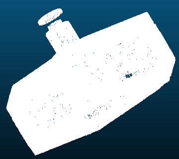
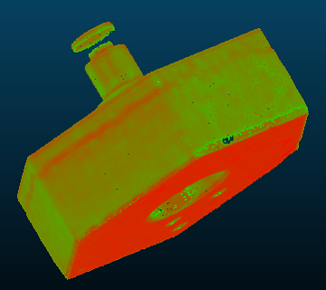
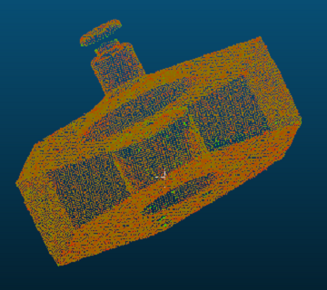

# color_using_resolution
使用`Kd-tree`对每个点查找周围某个半径内的点数(`n`),并找得最大`n`以及最小`n`, 分别令为`min_n`和`max_n`
则每个点的`rgb`设置为:
``` C++
points[i].r = (n-min_n)/(max_n-min_n) * 255;
points[i].g = 255 - ((n-min_n)/(max_n-min_n)) * 255;
points[i].b = 0;
```
可见，以此算法计算得出的点云密度高的点颜色会趋近于红色`(red==255)`，
而密度低的则会呈现绿色`(g==255)`

# 效果




# 使用
``` C++
pcl::PointCloud<pcl::PointXYZ>::Ptr cloud(new pcl::PointCloud<pcl::PointXYZ>);
pcl::PointCloud<pcl::PointXYZRGB>::Ptr cloud_rgb(new pcl::PointCloud<pcl::PointXYZRGB>);
CloudTools cloud_tools;
cloud_tools.color_using_resolution(cloud, cloud_rgb);
```