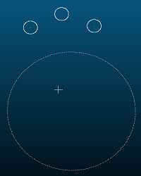

# fitting_circle_cloud_plane
其实通过拟合得到圆形的半径不难，但是在如何绘制标准圆在对应点云的位置费了不少功夫

# 效果




# 使用
``` C++
CloudTools cloud_tools;
cloud_tools.find_center_point3d(cloud, circle_center);

cloud_tools.fitting_circle_cloud_plane(cloud, circle_cloud, circle_center, radius, true);
```

# Note
这里的大致思路就是

点云圆形拟合 `->` 得到R `->` **调整R** `->` 在 xy 平面绘制图像，并且平移到点云重心 `->` 通过icp获取旋转矩阵