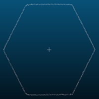
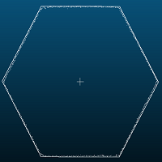

# fitting_hexagon_cloud_plane
通过拟合得到大致的半径，通过调整半径得到完整的六边形

# 效果



# 使用

``` C++
CloudTools cloud_tools;
cloud_tools.filter_voxel_grid_downsample(cloud, cloud, 0.2);

pcl::PointCloud<pcl::PointXYZ>::Ptr cloud_xyz(new pcl::PointCloud<pcl::PointXYZ>);
pcl::fromPCLPointCloud2<pcl::PointXYZ>(*cloud, *cloud_xyz);

pcl::PointCloud<pcl::PointXYZ>::Ptr std_cloud(new pcl::PointCloud<pcl::PointXYZ>);
pcl::PointXYZ center_point;

float radius;

cloud_tools.find_center_point3d(cloud_xyz, center_point);
cloud_tools.fitting_hexagon_cloud_plane(cloud_xyz, std_cloud, center_point, radius);
```