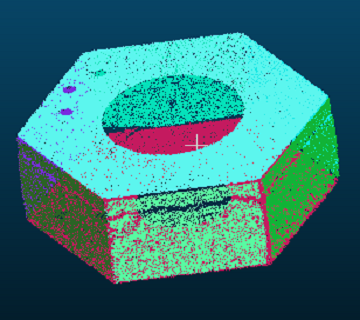

# segment_plane
基于`kd-tree`和自然生长算法的分割平面解决方案

# 效果




得到八个平面点云，分别用不同颜色标注

# 使用

``` C++
// 分割平面
vector<vector<int>> total_plane_index;
cloud_tools.plane_segment(cloud_normal, total_plane_index, 0.8, 15, 5000);
cout<<"分割平面数:"<<total_plane_index.size()<<endl;
// 保存各个平面并计算各个平面的重心
vector<pcl::PointCloud<pcl::PointXYZ>> cloud_vec(total_plane_index.size());
vector<pcl::PointXYZ> center_point_vec(total_plane_index.size());
Eigen::Vector4f centroid;
for (int i = 0; i < total_plane_index.size(); ++i)
{
    cloud_tools.index_vector_to_cloud<pcl::PointNormal, pcl::PointXYZ>
        (total_plane_index[i], *cloud_normal, cloud_vec[i]);

    pcl::compute3DCentroid(cloud_vec[i], centroid);
    center_point_vec[i].x = centroid[0];
    center_point_vec[i].y = centroid[1];
    center_point_vec[i].z = centroid[2];
}

// 通过平面重心判断是否有重叠点云
for (int i = 0; i < center_point_vec.size(); ++i)
{
    if (cloud_vec[i].width == 0) 
    {
        continue;
    }
    for (int j = i + 1; j < center_point_vec.size(); ++j)
    {
        if (cloud_vec[j].width == 0)
        {
            continue;
        }
        double distance = pcl::geometry::distance(center_point_vec[i], center_point_vec[j]);
        //cout << "distanc:" << distance << endl;
        if (distance < 5 ) {
            cloud_vec[i] += cloud_vec[j];
            cloud_vec[j].clear();
        }
    }
}

// 保存有效点云
int plane_count = 0;
for (int i = 0; i < cloud_vec.size(); ++i)
{
    if(cloud_vec[i].width != 0)
    {
        string str = "plane" + std::to_string(plane_count) + ".pcd";
        cloud_tools.save_cloud_with_random_color<pcl::PointXYZ>(str, cloud_vec[i], generator);
        plane_count = plane_count + 1;
    }
}
```

# Note
此算法根据法向分布聚类，仅得到平面点云数据，而不是点云所在平面方程

另: 点云聚类十分依赖可靠的radius，以及聚类条件是否成立的angle.

在某些数据中表现效果不错，但还有大幅的改进空间