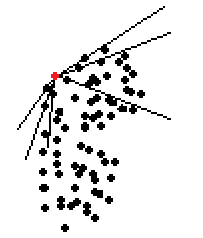
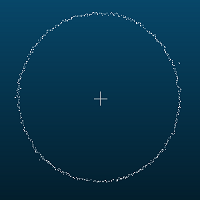
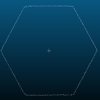

# segment_plane_border
使用自然生长算法通过角度限制获取(平面)点云边界



# 效果







# 使用

``` C++
CloudTools cloud_tools;
// 将判定区间分为24(360/15=)个,只要有一个区间没有周围没有点集则判定为边界点，区间判定数值越大越严格
cloud_tools.border_segment(border_group, cloud_xyz, 50);
```

# Note
建议在处理前使用体素滤波

在获取到全部边界后使用统计滤波
